# 西游杀 · 电脑与安卓版

  

正式版：电脑与独立开服器 v0.12.5 · Windows x64 / 安卓 v0.12.0 · Android ARM64

## 参考来源与权利联系

本项目由 Good哥 制作，为非官方、非商业的个人学习与交流项目，免费提供，不以本项目本体进行售卖。

本项目的程序实现与玩法开发参考了 [w159014462z/UnityDemo](https://github.com/w159014462z/UnityDemo)。部分卡牌、人物资料及相关素材参考或来源于该项目及玩家收集整理的资料。第三方角色形象、卡牌、美术、文字及其他素材的相关权利归各自权利人所有，本人不主张拥有上述第三方内容的著作权或商标权。

本项目与相关原权利人、品牌方不存在官方授权、合作或背书关系。

如相关权利人认为本项目使用了您的作品、商标或其他合法权益，请通过 [GitHub Issue](https://github.com/zxz0119/xiyousha-desktop/issues/new)、[反馈表](https://docs.qq.com/form/page/DYUVacFVFQm10dkJm)或 [QQ 频道](https://pd.qq.com/g/638742444094528756)联系作者，并注明涉及的图片、卡牌、文字、页面或文件。经核实后，我会及时停止相关内容的展示与分发，并删除、替换或采取其他必要处理。

公开下载与更新说明仅保留当前版本，已下架版本不再提供下载。

**0.12.5 游戏与独立开服器正式发布。** 本页采用最新包内截图，包含服务器大厅、个人战绩、装备交互、三人身份和救援接续修复。安卓版保持0.12.0，电脑手机联机须相同版本及兼容协议。

《西游杀》是本人的个人学习与交流项目。电脑版可以开3–12人的单机局，也支持局域网真人与AI混合对局、三档AI、人物技能、卡牌查询、存档、对局日志和视频导出。0.12.5新增服务器大厅、独立Windows开服器和个人战绩；服务器同一端口可管理多间房。安卓版仍为0.12.0，发行APK及其下载入口保持。

[下载游戏 Windows x64 安装包（v0.12.5）](https://github.com/zxz0119/xiyousha-desktop/releases/download/v0.12.5/xiyousha_0.12.5_x64-setup.exe) · [下载独立开服器（v0.12.5）](https://github.com/zxz0119/xiyousha-desktop/releases/download/v0.12.5/xiyousha-server_0.12.5_x64-setup.exe) · [查看正式发布说明](https://github.com/zxz0119/xiyousha-desktop/releases/tag/v0.12.5)

[访问西游杀项目主页：当前版本与游戏介绍](https://zxz0119.github.io/xiyousha-desktop/) · [夸克网盘：备用下载](https://pan.quark.cn/s/7b98d60e6ce2?pwd=Jd1Z)

夸克链接已携带提取码，点击即可进入。

[查看安卓版介绍、截图与更新说明](https://zxz0119.github.io/xiyousha-desktop/#mobile)：安卓版0.12.0发行APK已上传夸克，项目主页下载入口开放时间为2026年10月7日17:00（北京时间），到点后自动显示夸克下载链接。安卓版不通过GitHub Release发布。

[填写问题反馈](https://docs.qq.com/form/page/DYUVacFVFQm10dkJm) · [查看反馈问题](https://docs.qq.com/smartsheet/DYW5qVFFMVHdaWndt)

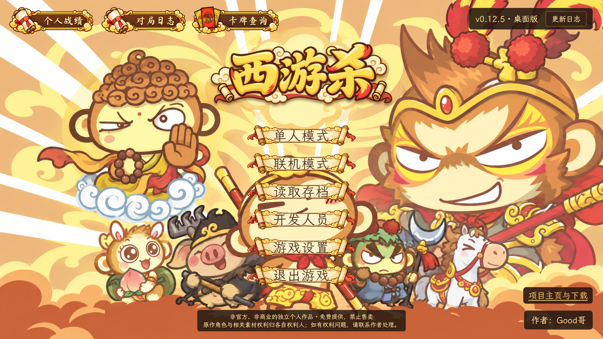

## 视频发布

游戏演示与相关视频发布在 [哔哩哔哩主页](https://space.bilibili.com/1596687164/upload/video)。

## 交流群

欢迎加入 [**西游杀 · 玩家交流 QQ 频道**](https://pd.qq.com/g/638742444094528756)，查看版本公告、交流玩法、联机约局与反馈问题。

  

欢迎加入 **西游杀 QQ 交流群**，交流玩法、反馈问题和约局。

**群号：1126010456**。可以搜索群号，或用QQ扫描下方二维码加入。

  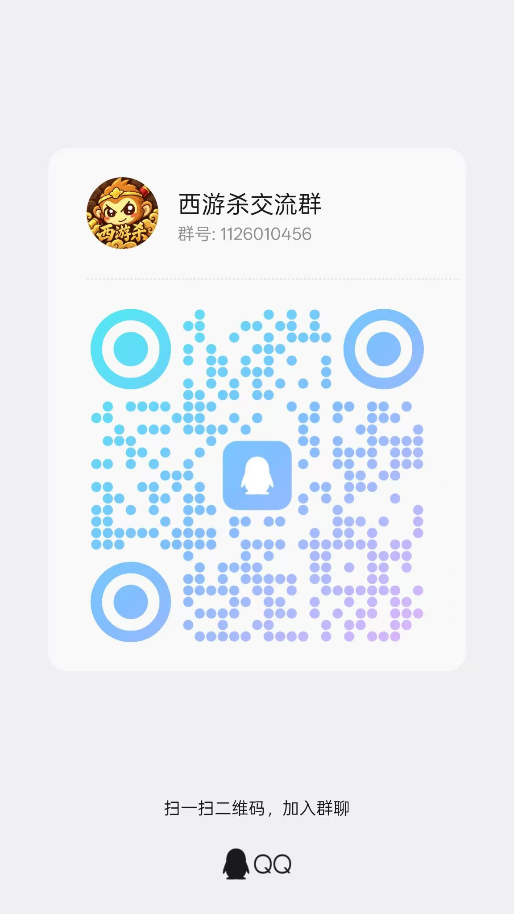

## 安卓版 0.12.0

项目主页下载入口开放时间：**2026-10-07 17:00（北京时间）**。发行APK已上传夸克；实际下载入口见[项目主页移动端](https://zxz0119.github.io/xiyousha-desktop/#mobile)为准。

| 项目 | 安卓版 |
|---|---|
| 设备 | Android 7.0及以上，64位ARM手机／平板；横屏游玩 |
| 安装包 | 0.12.0发行APK，约113.21MiB |
| 对局 | 3–8人单机／局域网；电脑手机联机须相同版本及兼容协议 |
| 显示 | 标准／大字；沿用电脑区域关系、八人座位与西游美术 |
| 导出 | TXT／诊断保存和系统分享；本机1920×1080、30帧静音MP4 |
| 更新 | 从项目主页获取APK手动覆盖安装，保持应用标识与发行签名 |

### 手机版画面

以下为新版发行应用的Android模拟器运行画面，网页提供轻量预览与高清放大；不同设备的可用空间及导出速度会有差异。

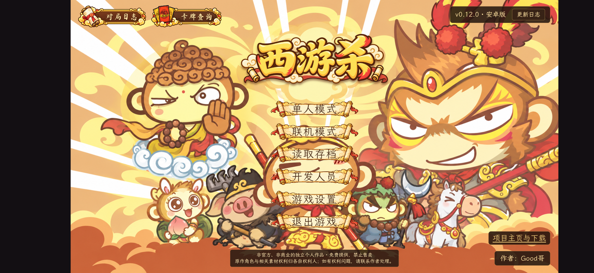

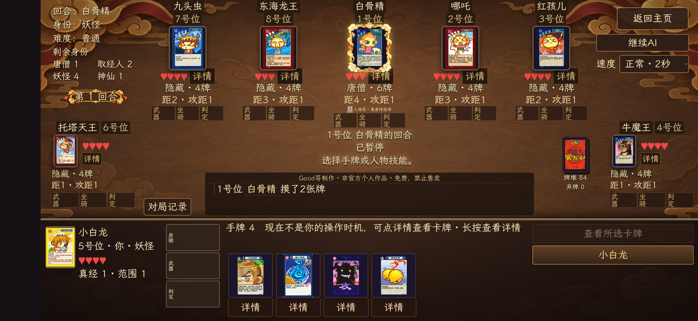

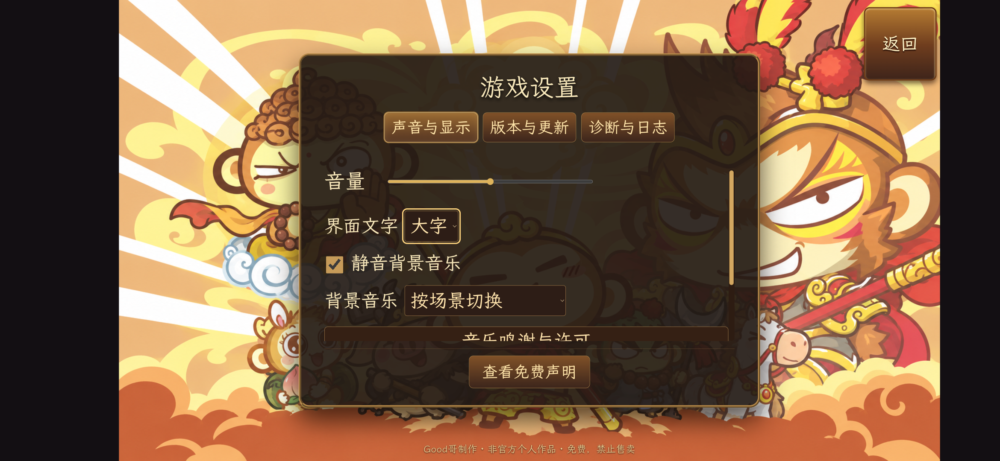

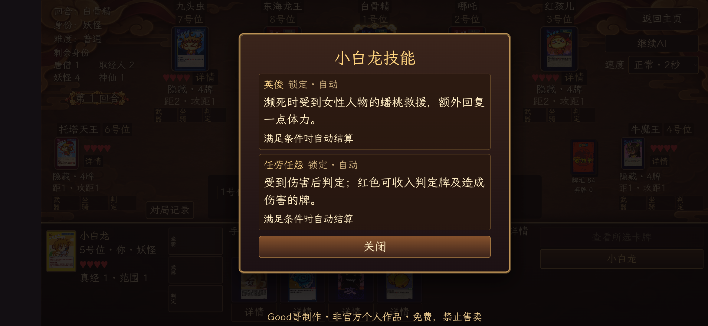

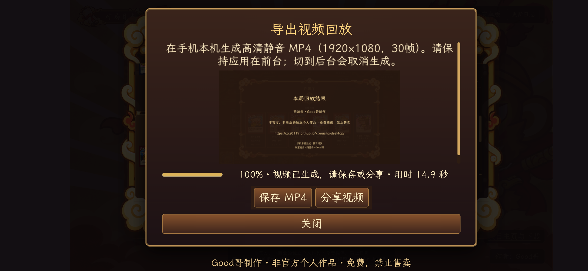

### 安卓版这次包含什么

- 手机／平板显示与触摸适配，标准、大字可选；修复GM、结算、弹窗、近期日志与操作区遮挡，判定、摸牌、确认弃置和结束回合保持固定可见。
- 人物名称打开全部主动、被动说明，主动按钮持续显示，暂时不可用置灰；白骨精借用人物、本体与唐僧身份各自显示。左侧装备详情保留，选择合法用法后确认执行，查看不发动、不消耗。
- 单人与联机对局日志的结算信息默认折叠，人物、时间、阵营及真经需要时展开查看；切换对局恢复折叠，回合日志与底部导出入口保留空间。
- 同步0.12.0共用规则：牛魔王第二次出攻摸牌、袈裟连续反制、坐骑响应及变身资格、唐僧真身、技能来源／击败奖励、太白金星体力与偷天换日花色；普通攻和附加伤害可提交部分受，旧记录保留原结算。
- 质量95高清资源，普通牌桌使用缩略图，详情与视频使用高清图；发行包约113.21MiB。
- 运行日志TXT、对局记录与诊断支持保存和系统分享。本机输出1080p、30帧静音MP4，保留本人视角、动作与动画；减少重复绘制，长录像分块处理，支持进度、取消、失败清理及保存／分享。

[查看安卓版完整更新记录](https://zxz0119.github.io/xiyousha-desktop/#mobile-release-v0.12.0)

### 安装、更新与使用

下载开放后，在项目主页进入夸克并选择安卓版APK，按Android提示允许当前下载工具安装应用。更新前先保存对局、退出联机，再直接覆盖安装；同应用标识、同发行签名升级保留本机存档和记录，卸载后可能删除应用数据。

含手机席位的房间最多8人；纯电脑仍为3–12人。实际Wi-Fi／热点受设备与路由器影响，搜索不到时可用IP直连；房主应用进程被系统关闭时房间结束。两端单机存档独立保存。导出视频时请保持应用在前台，切后台会取消生成，耗时随记录长度及设备性能变化。

当前不提供iOS或32位APK。F11、电脑自定义音乐、电脑自动更新及视频背景音乐是电脑功能，安卓视频为静音MP4。

## 电脑版使用说明

以下说明对应电脑版0.12.5。游戏截图来自实际包内页面；开服器安装包的程序/资源一致性已检查，界面验证使用同内置前端/运行资源和生产处理器的隔离QA宿主。未执行真实覆盖安装、公网或安卓混合对局实测。

## 怎么开一局

在主页点“单人模式”，选好人数和难度，就可以抽身份、选人物。新版对局同身份互相可见，唐僧也能识别全部取经人；其余未公开身份继续保密。每人从三张候选人物里选一张，拿到4张起始手牌，旧存档和录像保留原规则。

返回设置后再次确认，会重新抽身份和候选人物。查看卡面不会重抽；读取存档则继续原来的局。身份随机，有时会碰巧抽到同一个。

轮到你时，按判定、摸牌、出牌、弃牌的顺序操作。手牌超过上限，要先弃够牌才能结束回合。出牌时点手牌和目标，再确认；遇到攻击、单挑或其他需要响应的效果，桌面会提示当前该做什么。没看清刚才发生了什么，可以翻最近行动或完整对局记录。

## 多人联机与服务器大厅

主页选择“联机模式”，设置昵称后创建房间，或通过自动发现、IP直连加入朋友的房间。房主可配置3–12人、AI数量与难度、人物／实体卡牌禁用以及各阶段时限。所有玩家准备、选将后开始对局；联机禁用GM。

电脑与手机联机需要相同版本和兼容协议；含手机席位的房间最多8人，纯电脑房间仍为3–12人。电脑搜索重复广播约2.4秒，网络阻止广播时可用IP直连；真实Wi-Fi受设备与路由器配置影响。

新房间出牌阶段默认120秒，可在房间设置调整。支持公共聊天、私聊、掉线后按设置AI接管和原席位重连；牌桌按公开信息显示剩余身份数量。联机需要双方网络互通并允许相应防火墙连接。

“加入服务器”只需粘贴完整的IP:端口、域名或服务器邀请地址。进入后显示服务器名称与地址，可创建、搜索和加入服务器房间；离开房间返回大厅，退出服务器后恢复局域网搜索。连接/搜索显示加载反馈，超时、失败后可重试。服务器房间邀请带`/rooms/房间号`，普通局域网、蒲公英和公网单房间直连流程保留。

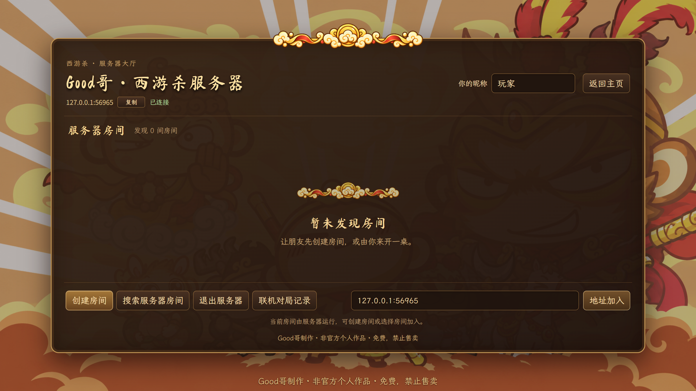

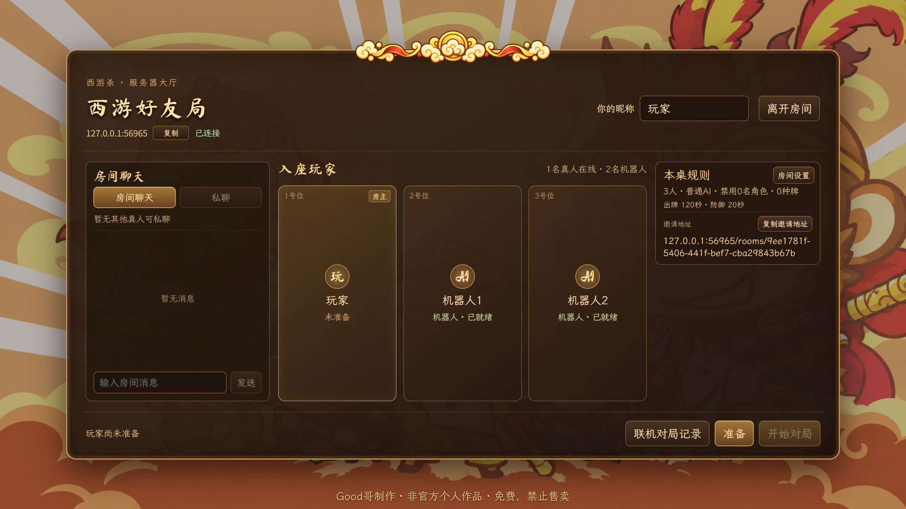

### 独立开服器

独立Windows x64安装包约46.74MiB，与游戏0.12.5配套使用；游戏约230.98MiB。Good哥制作 · 非官方个人学习与交流项目 · 免费提供，不以项目本体进行售卖。

开服器是单独的Windows软件，可以设置服务器名称、监听端口、房间/连接上限及内存保护值，查看房间、玩家、负载和日志。关闭会确认并停止服务、保存日志；重启保留日志，提供打开目录入口。游戏和开服器使用各自的数据目录。

把可达的IP或域名加端口发给玩家，他们可在服务器中自行建房。用于公网时需配置实际对外端口、防火墙及网络映射；本机监听成功不代表公网已连通。

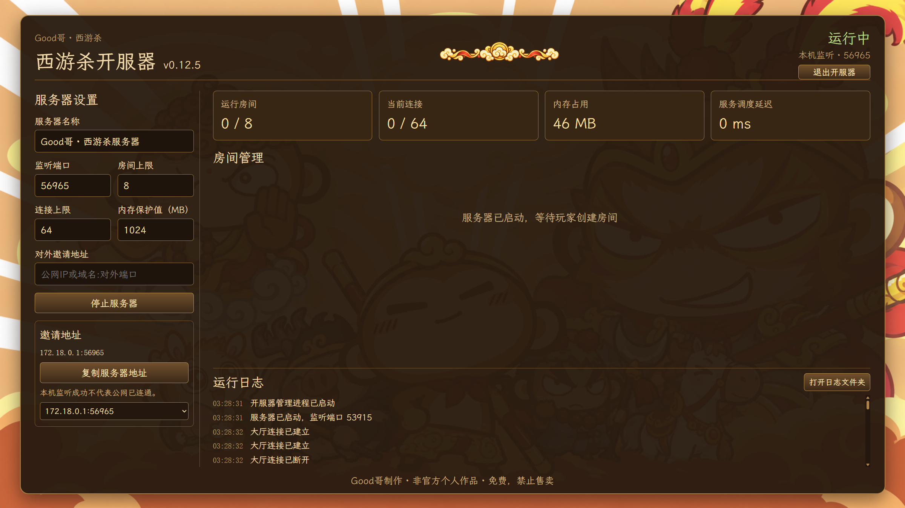

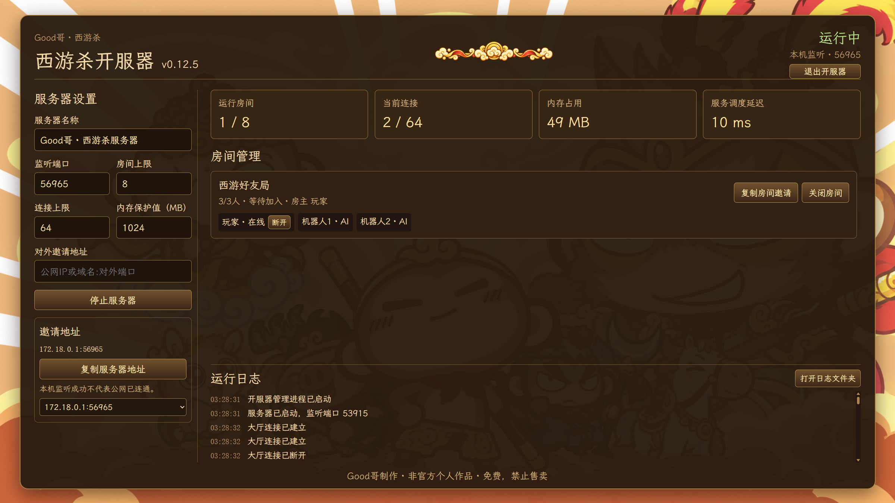

## 身份怎么算赢

主页“卡牌查询”的“身份”页可以查看四种身份牌和胜利条件，也能放大卡面。

- 唐僧和取经人要击败所有妖怪、神仙，唐僧不能阵亡。
- 妖怪要击败唐僧，并且场上还得有妖怪存活。
- 神仙要先击败所有妖怪，再击败唐僧，自己也得活着。

人数不同，身份数量也不同。

| 人数 | 唐僧 | 取经人 | 妖怪 | 神仙 |
|---|---|---|---|---|
| 3 | 1 | 0 | 1 | 1 |
| 4 | 1 | 1 | 1 | 1 |
| 5 | 1 | 1 | 2 | 1 |
| 6 | 1 | 1 | 3 | 1 |
| 7 | 1 | 2 | 3 | 1 |
| 8 | 1 | 2 | 4 | 1 |
| 9 | 1 | 3 | 4 | 1 |
| 10 | 1 | 3 | 4 | 2 |
| 11 | 1 | 3 | 5 | 2 |
| 12 | 1 | 4 | 5 | 2 |

4 到 12 人的身份数量按《西游杀规则手册》的准备阶段表分配。手册没有列 3 人局，当前0.12.5的新三人局采用唐僧、妖怪、神仙各一人；旧记录保留当局原分配。

## 人物与技能

人物池现在有 41 人，包含毗蓝婆与灵吉菩萨。蜘蛛精和如来佛祖都是 3 点体力；齐天大圣与孙悟空是两张独立的人物卡，可以同场。

不熟悉技能时，可以在主页打开“卡牌查询”，切到“人物”页搜索名字。对局里也能点人物卡查看卡面。右侧点击人物名称或“唐僧身份”可查看完整主动、被动、自动技能说明；主动按钮一直显示，条件不满足时置灰。白骨精借用人物与本体分别显示。

唐僧身份卡有三项技能。人物层被击败后启用两点体力的真身。

- 唐僧肉在真身阶段生效。每次受攻的伤害，成功攻击者恢复一点体力，不超过上限。
- 紧箍咒每回合一次，要求孙悟空、猪八戒或沙和尚攻击合法目标；没有出攻，唐僧摸一张。
- 往生咒整局一次，在死亡确认、身份公开前恢复目标两点体力，保留手牌、装备和判定牌。可以救唐僧自己的选用人物层，不能救真身。放弃不消耗次数。

### 如来神掌与伤害收牌

- 如来神掌要出两张“受”才能挡住。一张金钟罩或锦阑袈裟也能保护你；只出一张“受”就放弃，那张牌照常弃掉，仍会失去 1 点体力。
- 如来神掌和铁扇公主转化的火焰山都有两张来源牌。观音、小白龙受伤后都成功收牌，各得一张；小白龙判定失败，观音就拿到两张。即使已经没有来源牌可拿，小白龙受伤后仍会判定，红色判定牌可以收入手牌。

## 牌库与装备

自动装备效果不需要选中。主动/一次性装备点名称选择，旁边“详”只查看；多件时展开逐行文字和详情，关闭保留选择，再点同件或清空取消。琵琶先点装备，再选捆索用途、目标并确认。所有有效已装备武器和坐骑取最大范围，包含尚未消耗的一次性武器；附加加伤仍需选择并满足条件。消耗后后续范围重新计算，本次按声明范围完成。

当前新版牌堆共118张、51种牌，卡牌查询显示78个花色卡面。同一种花色卡面在牌堆里可能有多张；房间禁用实体牌后，当局数量会相应减少。

| 分类 | 牌种 | 卡面 | 张数 |
|---|---:|---:|---:|
| 基础牌 | 3 | 12 | 52 |
| 技能牌 | 27 | 45 | 45 |
| 武器 | 11 | 11 | 11 |
| 坐骑 | 10 | 10 | 10 |
| 合计 | 51 | 78 | 118 |

七星宝剑、金刚圈、紫金铃铛、九瓣花花锤和琵琶是常驻武器。八丈火尖枪、九齿钉钉耙、方方便便铲、短短狼牙棒、红缨枪和金箍棒则是一次性的附加武器。

坐骑谁都能装备，距离效果也都能用，但专属技能要看人物或身份。例如，大鹏金翅鸟的身份交换只有如来佛祖能发动；弥勒佛和其他人物都可以装备它、使用距离效果。白龙马的专属技能给唐僧身份和小白龙使用。仙鹤、筋斗云、避水金睛兽、风火轮也各有对应的人物。

芭蕉扇会亮出与存活人数相同的牌。发动者先拿一张，之后从下一位存活玩家开始轮流选。这些牌公开展示，其他人的手牌仍然看不到。

## 没打完可以存，下次接着玩

游戏有 3 个存档槽。打到一半想停，可以从牌桌右上角“返回主页”保存；点窗口的 × 则会询问是否保存后关闭游戏。主页也有“退出游戏”按钮。

打完的对局会自动归档，在“对局日志”里能看行动记录和回放，也能导出诊断记录。当前规则的记录可以回放；旧规则原文件保留，支持的历史日志可只读查看。

当前安装包已内置视频导出所需运行资源。已结束的单人或联机对局可以导出本人视角的视频，可选择背景音乐；记录仍按原有动作重建，不重新运行AI。

当前0.12.5按对局记录中的相应规则处理。旧规则存档不能直接续局或按当前引擎导出视频，原文件不会因此删除；有重要存档和记录时请先备份。

遇到卡住、结算不对之类的问题，可以在退出弹窗点“导出诊断 TXT”。不用先选存档槽，点它也不会保存或退出游戏。即使存档校验失败，诊断文件仍会尽量留下错误信息和当前状态。

导出视频、诊断 TXT 或 JSON 时，都会先让你选保存位置，取消就不会生成文件。诊断文件只保存在本机，不会自动上传，不过里面可能有这局尚未公开的牌，分享前请留意。

个人战绩可按单人/联机及难度筛选，查看胜负、击杀阵亡、K/D、总经书、人物/身份与完整日志；旧记录缺少的数据显示未记录。

## 安装和更新

游戏安装包约230.98 MiB，下载后双击 `xiyousha_0.12.5_x64-setup.exe`，按向导安装。已有旧版的话，先保存对局、关闭程序，再覆盖安装。

更新下载支持暂停、继续和关闭重开后续传，显示速度与预计剩余时间。

在“游戏设置 → 版本与更新”里点“检查更新”，发现新版后可以下载。下载完成会验证签名，再由你确认安装。连不上 GitHub 或下载失败时，可以从设置页打开备用下载页面。

正常更新会保留存档和对局记录。如果自己卸载旧版，记得别勾选“删除应用数据”；有重要存档的话，先备份一份。

## v0.12.5 改了什么

本次同时发布游戏与独立开服器；转换详情、三人身份和救援问题已纳入本次安装包。

- 修复琵琶及角色转换的卡面解析：详情保留原实体花色卡面并显示实际用途，判定与AI仍使用转换后的效果；核查全部人物技能、公开事件和录像取图。
- 新三人局改为唐僧、妖怪、神仙，其他人数不变；旧存档/录像保留原分配。
- 生死簿或蟠桃大会被袈裟抵消后，当前救援者仍可继续出桃等合法救援；负体力逐次恢复，明确放弃才推进顺序，旧记录保留原接续。
- 调整灵吉菩萨卡面与人物头像比例，保留三点体力及两项技能说明，同步高清图与缩略图。

- 新增独立开服器、服务器大厅与同端口多房间；完整地址加入、创建/搜索、房间邀请、离房返回大厅和退出恢复局域网。
- 新增个人战绩和筛选；优化重复加入、取消、重连、操作回执与状态重同步，连接/搜索有明确加载反馈。
- 永久武器有效效果共同生效，铃铛自动摸牌；装备最大范围、附加加伤、坐骑转攻与专属资格统一。多装备/判定展开，琵琶用途和详情保留选择。
- 无牌时阎王醉和主动芭蕉扇禁用，牌不足按实际分配，芭蕉扇/定风珠池空及时结束；先弃后摸与自动摸牌保持合法流程。
- 修复人物卡、身份、装备栏、名字/标记、范围/详情与真身/变身状态遮挡；提示移入操作面板，箭头在对局顶层完整显示。
- 唐僧真身继承装备，唐僧能识别取经人；补齐毗蓝婆、灵吉菩萨、多武器/坐骑、真火与AI决策，新旧记录按对应规则读取。

[完整更新说明及双软件下载](https://github.com/zxz0119/xiyousha-desktop/releases/tag/v0.12.5)。使用旧0.12.5测试包时请手动下载本次安装包覆盖更新，游戏与开服器应配套更新。

359个文件1882项测试通过，发布/资源工具17项通过，游戏原公钥更新签名和篡改拒绝验证通过。公开旧版安装包已下架；用户本机存档和记录不因此删除。未执行真实覆盖安装、公网或安卓混合实测。

## 参考项目与鸣谢

感谢 [w159014462z/UnityDemo](https://github.com/w159014462z/UnityDemo) 提供的工程和玩法资料。电脑与安卓版参考了其中的内容，用 Tauri、React 和 TypeScript 重新写了游戏逻辑与界面。

主页背景、标题、卷轴和行动框是重新制作的。字体用了 [Ma Shan Zheng](https://github.com/googlefonts/mashanzheng/blob/master/OFL.txt) 和 [LXGW WenKai Lite](https://github.com/lxgw/LxgwWenKai-Lite/blob/main/OFL.txt)，程序里附有对应的许可文件。

第三方内容来源与权利说明见本页开头及末尾的声明。

音乐也保留原作者与许可：

- [Guzheng City — Kevin MacLeod](https://incompetech.com/music/royalty-free/index.html?Search=Search&isrc=USUAN2100001)，[CC BY 4.0](https://creativecommons.org/licenses/by/4.0/)。
- [Eastern Thought — Kevin MacLeod](https://incompetech.com/music/royalty-free/index.html?Search=Search&isrc=USUAN1100682)，[CC BY 4.0](https://creativecommons.org/licenses/by/4.0/)。
- [Asianoriental2 — Tozan](https://opengameart.org/content/asianoriental2)，[CC0 1.0](https://creativecommons.org/publicdomain/zero/1.0/)。
- [Oriented — yd](https://opengameart.org/content/oriented)，[CC0 1.0](https://creativecommons.org/publicdomain/zero/1.0/)。

音乐未裁剪、未改编，播放器仅控制音量和循环；这些许可不替代第三方卡面及人物素材的授权。

## 关于卡牌资料与权利声明

本项目由 Good哥 制作，为非官方、非商业的个人学习与交流项目，免费提供，不以本项目本体进行售卖。

本项目的程序实现与玩法开发参考了 [w159014462z/UnityDemo](https://github.com/w159014462z/UnityDemo)。部分卡牌、人物资料及相关素材参考或来源于该项目及玩家收集整理的资料。第三方角色形象、卡牌、美术、文字及其他素材的相关权利归各自权利人所有，本人不主张拥有上述第三方内容的著作权或商标权。

本项目与相关原权利人、品牌方不存在官方授权、合作或背书关系。

如相关权利人认为本项目使用了您的作品、商标或其他合法权益，请通过 [GitHub Issue](https://github.com/zxz0119/xiyousha-desktop/issues/new)、[反馈表](https://docs.qq.com/form/page/DYUVacFVFQm10dkJm)或 [QQ 频道](https://pd.qq.com/g/638742444094528756)联系作者，并注明涉及的图片、卡牌、文字、页面或文件。经核实后，我会及时停止相关内容的展示与分发，并删除、替换或采取其他必要处理。

卡牌文字、技能或结算问题也可通过上述入口反馈。提供牌名、发生步骤和截图，便于核对；分享对局诊断前请留意其中的未公开信息。
