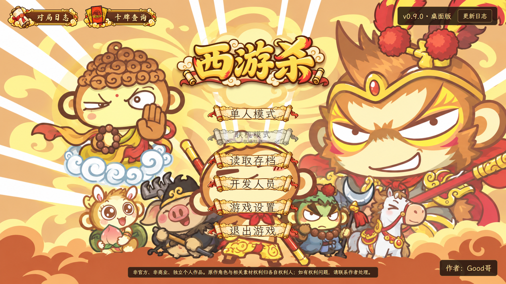
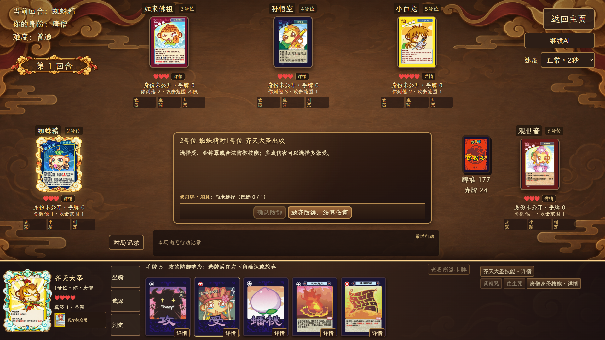
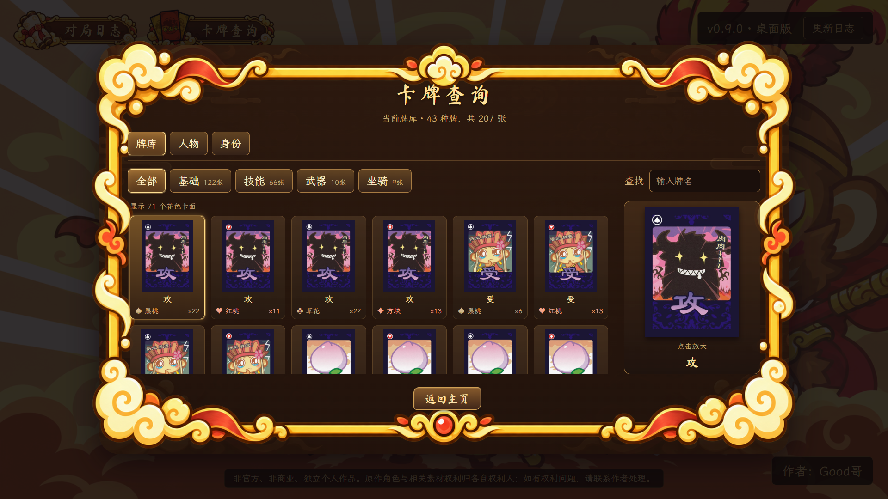
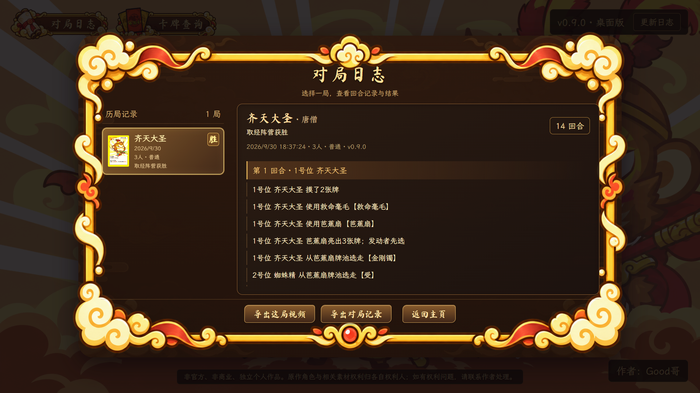

# 西游杀桌面版

Windows x64桌面卡牌游戏，支持3–12人单机对局、三档AI、人物技能、卡牌查询、存档和对局记录。

**当前公开安装包：v0.9.0。** 0.10.0正在开发，新增局域网联机及近期交互、加载和录像修复，尚未发布新安装包。下方截图来自已发布的0.9.0。

[下载v0.9.0安装包](https://github.com/zxz0119/xiyousha-desktop/releases/download/v0.9.0/xiyousha_0.9.0_x64-setup.exe) · [查看发布说明](https://github.com/zxz0119/xiyousha-desktop/releases/tag/v0.9.0) · [所有版本](https://github.com/zxz0119/xiyousha-desktop/releases)

## 已发布版本怎么玩

在单人模式选择3–12人及简单、普通或困难AI，抽取身份后从三名候选人物中选一名。人物池有39人，每席起始四张手牌。正常回合依次处理回合开始与判定、摸牌、出牌、弃牌；受到攻击或技能时按提示响应。

唐僧与取经人共同击败妖怪和神仙，唐僧须存活；妖怪击败唐僧且仍有妖怪存活；神仙先击败妖怪，再击败唐僧且自己存活。除唐僧外的身份默认隐藏，阵亡后公开。

不熟悉卡牌或人物技能时可打开“卡牌查询”，对局中也能点详情查看。存档与退出确认、最近行动、完整记录和历史归档都有对应入口。

## 0.10.0开发进度

当前源码已实现3–12人局域网真人／AI混合房间、自动发现与IP直连、选将、人物及卡牌禁用、公共聊天与私聊、掉线接管与重连。房间默认出牌时间延长为120秒，牌桌显示按公开信息推算的剩余身份。

近期修复包括卡面缩略图与可见区域加载、失败重试、群攻等待提示、日志摘要读取、普通攻受与装备转换切换、旧0.10.0录像重建及视频导出优化。已完成相关源码与开发环境验证；正式安装、升级及跨电脑联机还需在对应环境验收。

这些是开发中功能，不代表0.9.0安装包已经具备。源码、项目规则和开发／打包文档维护在私有仓库，正式安装包、签名和更新清单在本仓库Releases发布。

## 安装与更新

下载并运行Windows x64安装包，按安装向导完成安装。带更新器的版本可在“游戏设置 → 版本与更新”检查新版本；更新包会验签，再由用户确认安装。

## 反馈与资源说明

游戏为非官方、非商业的个人作品，人物与卡面等素材权利属于各自权利人。代码与玩法资料参考 [w159014462z/UnityDemo](https://github.com/w159014462z/UnityDemo)，桌面程序使用Tauri、React和TypeScript重新实现。字体、音乐及相关许可在程序内提供鸣谢。

发现牌面、技能、结算或安装问题，可提交 [Issue](https://github.com/zxz0119/xiyousha-desktop/issues/new)，附版本、复现步骤和必要截图。诊断文件可能包含隐藏身份与手牌，公开分享前请检查内容。
