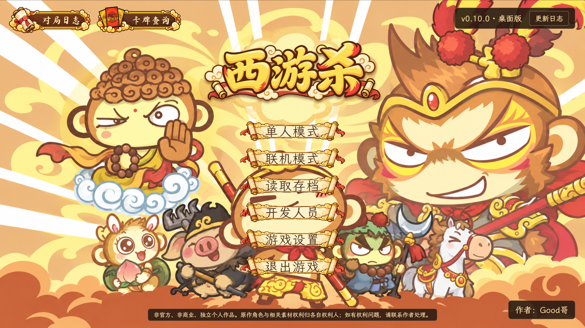
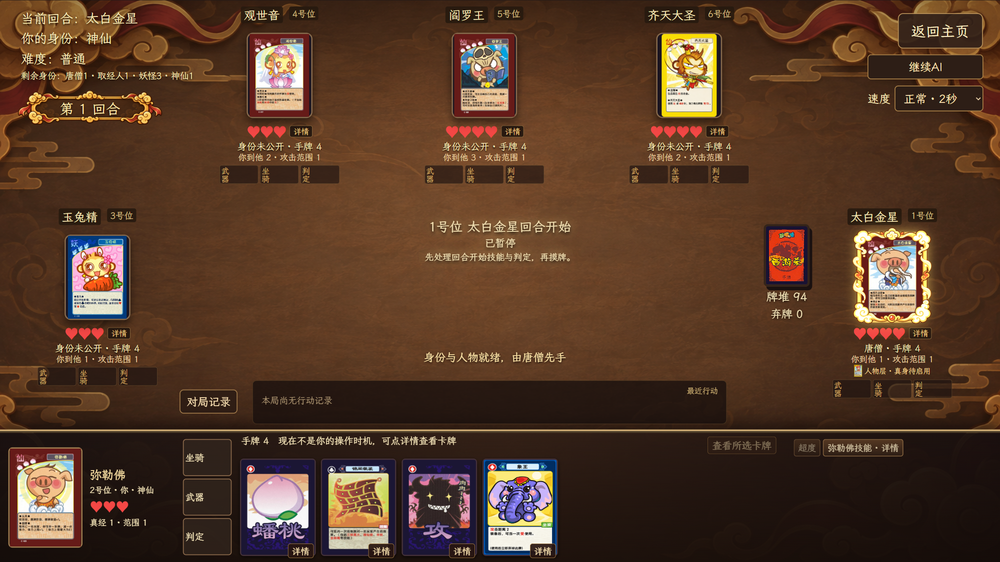
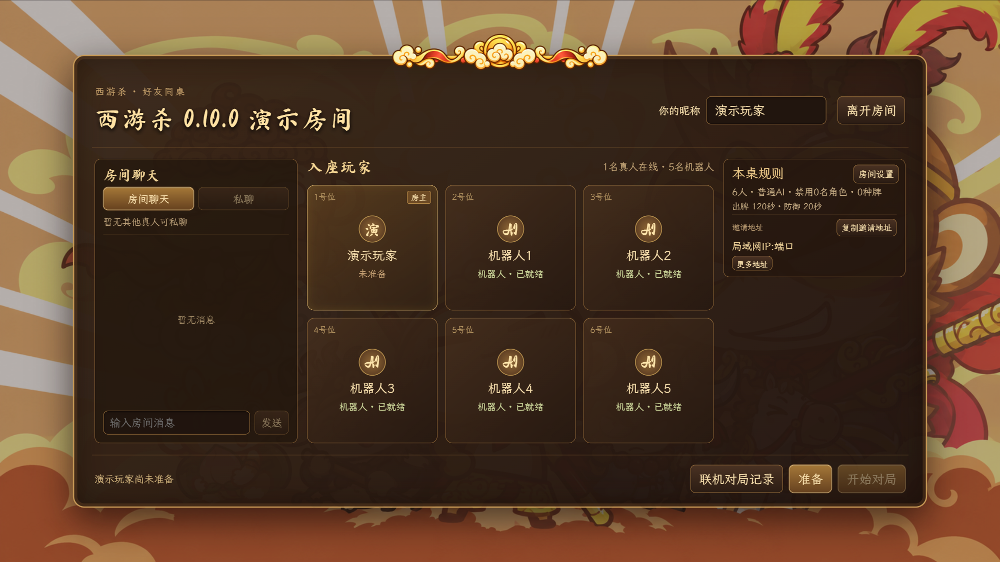
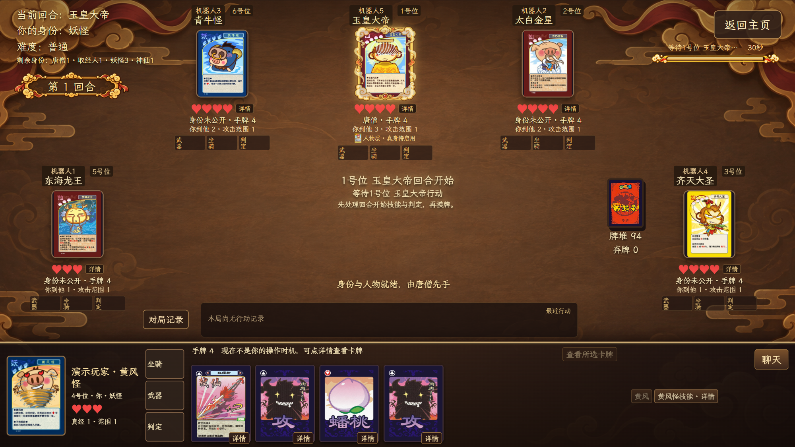
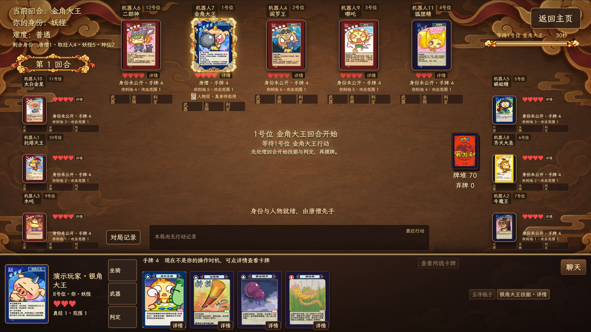
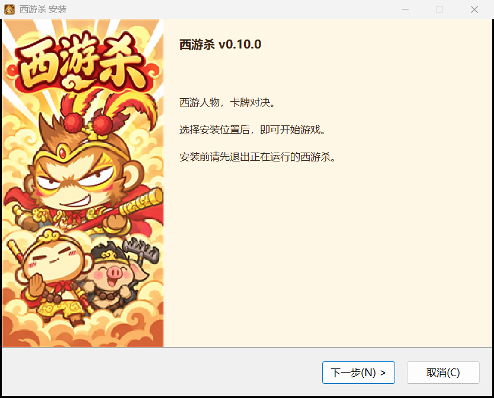

# 西游杀桌面版

  

v0.10.0 · Windows x64 桌面版

这是我做的《西游杀》桌面版。可以开3–12人的单机局，也可以在同一局域网内创建真人与AI混合房间。支持简单、普通、困难AI、人物技能、卡牌查询、存档、对局记录和视频导出。当前正式版本为0.10.0。

[下载 Windows x64 安装包（v0.10.0）](https://github.com/zxz0119/xiyousha-desktop/releases/download/v0.10.0/xiyousha_0.10.0_x64-setup.exe) · [查看发布说明](https://github.com/zxz0119/xiyousha-desktop/releases/tag/v0.10.0)

[访问西游杀官网：游戏介绍与各版本更新](https://zxz0119.github.io/xiyousha-desktop/) · [夸克网盘：各版本安装包](https://pan.quark.cn/s/7b98d60e6ce2)

夸克提取码：**Jd1Z**。

## 交流群

欢迎加入 **西游杀 QQ 交流群**，交流玩法、反馈问题和约局。

**群号：1126010456**。可以搜索群号，或用QQ扫描下方二维码加入。

  

## 怎么开一局

在主页点“单人模式”，选好人数和难度，就可以抽身份、选人物。身份随机分配，你能看到自己的身份和谁是唐僧，其他身份默认隐藏，阵亡后公开。每人从三张候选人物里选一张，拿到 4 张起始手牌。

返回设置后再次确认，会重新抽身份和候选人物。查看卡面不会重抽；读取存档则继续原来的局。身份随机，有时会碰巧抽到同一个。

轮到你时，按判定、摸牌、出牌、弃牌的顺序操作。手牌超过上限，要先弃够牌才能结束回合。出牌时点手牌和目标，再确认；遇到攻击、单挑或其他需要响应的效果，桌面会提示当前该做什么。没看清刚才发生了什么，可以翻最近行动或完整对局记录。

## 局域网联机

主页选择“联机模式”，设置昵称后创建房间，或通过自动发现、IP直连加入朋友的房间。房主可配置3–12人、AI数量与难度、人物／实体卡牌禁用以及各阶段时限。所有玩家准备、选将后开始对局；联机禁用GM。

新房间出牌阶段默认120秒，可在房间设置调整。支持公共聊天、私聊、掉线后按设置AI接管和原席位重连；牌桌按公开信息显示剩余身份数量。联机需要双方网络互通并允许相应防火墙连接。

## 身份怎么算赢

主页“卡牌查询”的“身份”页可以查看四种身份牌和胜利条件，也能放大卡面。

- 唐僧和取经人要击败所有妖怪、神仙，唐僧不能阵亡。
- 妖怪要击败唐僧，并且场上还得有妖怪存活。
- 神仙要先击败所有妖怪，再击败唐僧，自己也得活着。

人数不同，身份数量也不同。

| 人数 | 唐僧 | 取经人 | 妖怪 | 神仙 |
|---|---|---|---|---|
| 3 | 1 | 1 | 1 | 0 |
| 4 | 1 | 1 | 1 | 1 |
| 5 | 1 | 1 | 2 | 1 |
| 6 | 1 | 1 | 3 | 1 |
| 7 | 1 | 2 | 3 | 1 |
| 8 | 1 | 2 | 4 | 1 |
| 9 | 1 | 3 | 4 | 1 |
| 10 | 1 | 3 | 4 | 2 |
| 11 | 1 | 3 | 5 | 2 |
| 12 | 1 | 4 | 5 | 2 |

4 到 12 人的身份数量按《西游杀规则手册》的准备阶段表分配。手册没有列 3 人局，这里保留唐僧、取经人、妖怪各一人的玩法。

## 人物与技能

人物池现在有 39 人。蜘蛛精和如来佛祖都是 3 点体力；齐天大圣与孙悟空是两张独立的人物卡，可以同场。

不熟悉技能时，可以在主页打开“卡牌查询”，切到“人物”页搜索名字。对局里也能点人物卡查看详情。

唐僧身份卡有三项技能。人物层被击败后启用两点体力的真身。

- 唐僧肉在真身阶段生效。每次受攻的伤害，成功攻击者恢复一点体力，不超过上限。
- 紧箍咒每回合一次，要求孙悟空、猪八戒或沙和尚攻击合法目标；没有出攻，唐僧摸一张。
- 往生咒整局一次，在死亡确认、身份公开前恢复目标两点体力，保留手牌、装备和判定牌。可以救唐僧自己的选用人物层，不能救真身。放弃不消耗次数。

### 如来神掌与伤害收牌

- 如来神掌要出两张“受”才能挡住。一张金钟罩或锦阑袈裟也能保护你；只出一张“受”就放弃，那张牌照常弃掉，仍会失去 1 点体力。
- 如来神掌和铁扇公主转化的火焰山都有两张来源牌。观音、小白龙受伤后都成功收牌，各得一张；小白龙判定失败，观音就拿到两张。即使已经没有来源牌可拿，小白龙受伤后仍会判定，红色判定牌可以收入手牌。

## 牌库与装备

当前新版牌堆共118张、51种牌，卡牌查询显示78个花色卡面。同一种花色卡面在牌堆里可能有多张；房间禁用实体牌后，当局数量会相应减少。

| 分类 | 牌种 | 卡面 | 张数 |
|---|---:|---:|---:|
| 基础牌 | 3 | 12 | 52 |
| 技能牌 | 27 | 45 | 45 |
| 武器 | 11 | 11 | 11 |
| 坐骑 | 10 | 10 | 10 |
| 合计 | 51 | 78 | 118 |

七星宝剑、金刚圈、紫金铃铛、九瓣花花锤和琵琶是常驻武器。八丈火尖枪、九齿钉钉耙、方方便便铲、短短狼牙棒、红缨枪和金箍棒则是一次性的附加武器。

坐骑谁都能装备，距离效果也都能用，但专属技能要看人物或身份。例如，大鹏金翅鸟的身份交换只有如来佛祖能发动；弥勒佛和其他人物都可以装备它、使用距离效果。白龙马的专属技能给唐僧身份和小白龙使用。仙鹤、筋斗云、避水金睛兽、风火轮也各有对应的人物。

芭蕉扇会亮出与存活人数相同的牌。发动者先拿一张，之后从下一位存活玩家开始轮流选。这些牌公开展示，其他人的手牌仍然看不到。

## 没打完可以存，下次接着玩

游戏有 3 个存档槽。打到一半想停，可以从牌桌右上角“返回主页”保存；点窗口的 × 则会询问是否保存后关闭游戏。主页也有“退出游戏”按钮。

打完的对局会自动归档，在“对局日志”里能看行动记录和回放，也能导出诊断记录。当前规则的记录可以回放；旧规则原文件保留，支持的历史日志可只读查看。

0.10.0安装包已内置视频导出所需运行资源。已结束的单人或联机对局可以导出本人视角的视频，可选择背景音乐；记录仍按原有动作重建，不重新运行AI。

0.10.0统一使用当前新版规则。旧规则存档不能直接续局或按当前引擎导出视频，原文件不会因此删除；有重要存档和记录时请先备份。

遇到卡住、结算不对之类的问题，可以在退出弹窗点“导出诊断 TXT”。不用先选存档槽，点它也不会保存或退出游戏。即使存档校验失败，诊断文件仍会尽量留下错误信息和当前状态。

导出视频、诊断 TXT 或 JSON 时，都会先让你选保存位置，取消就不会生成文件。诊断文件只保存在本机，不会自动上传，不过里面可能有这局尚未公开的牌，分享前请留意。

## 安装和更新

安装包约276.5 MiB，下载后双击 `xiyousha_0.10.0_x64-setup.exe`，按向导安装。已有旧版的话，先保存对局、关闭程序，再覆盖安装。

在“游戏设置 → 版本与更新”里点“检查更新”，发现新版后可以下载。下载完成会验证签名，再由你确认安装。连不上 GitHub 或下载失败时，可以从设置页打开备用下载页面。

正常更新会保留存档和对局记录。如果自己卸载旧版，记得别勾选“删除应用数据”；有重要存档的话，先备份一份。

## v0.10.0 改了什么

- 新增3–12人局域网真人／AI混合对局、房间配置、聊天、掉线接管与重连。
- 新增斗转星移、火眼金睛、放下屠刀，并补齐真人选牌、目标选择与确认入口。
- 卡面列表按可见区域加载缩略图，完整解码后显示，失败可重试。
- 优化群攻等待提示、剩余身份显示，修复普通攻受被装备转换选择阻挡。
- 优化归档摘要读取、记录阅读快照、旧0.10.0录像重建及带音乐视频导出。
- 补齐动作日志、实际体力结果与目标箭头。内置联机和视频运行资源，所以安装包比0.9.0更大。

v0.9.0更新记录

### v0.9.0

- 人物池有 39 人，蜘蛛精能用盘丝洞和施毒，如来佛祖的攻不受距离限制，也能发动如来神掌。20 张完整人物卡都已换成清晰的印刷版。
- 单机对局人数可选 3 到 12 人，各人数的身份数量按手册分配。
- 所有角色都能装备坐骑使用距离效果，专属技能仍由对应人物或身份发动。
- 大鹏的身份交换只由如来佛祖发动；弥勒佛保留通用距离效果。
- 卡牌查询可以查看四种身份。唐僧卡面与技能采用唐僧肉、每回合一次的紧箍咒、整局一次的往生咒。
- 返回设置后再次确认会重新抽签；卡面预览和读档保留结果。
- 旧存档继续局会迁移身份规则，首次覆盖前保留原备份，回放保留迁移前后的行动。
- 紧箍咒与狐狸精诱惑在回合结束后重新计数。
- 托塔天王猜拳平局可以重猜；六耳猕猴用硬币正反面判断，双方选择互相隐藏。
- 选中三昧真火时，选择按钮不会再横跨牌桌；人物卡外侧残留的白边也清理了。
- 小白龙在多种技能伤害后都会进行判定。观音与小白龙同时取得两张群体来源牌时各拿一张；小白龙判定失败，观音拿两张。
- 退出弹窗可直接导出诊断 TXT；视频与诊断文件导出时可选择保存位置。
- 返回主页、关闭游戏和主页退出会分别询问如何处理当前对局。
- 安装包减小到约 130 MB，卡面、字体和音乐保持原有画质与格式。
- 安装包支持回放与诊断导出；独立视频导出器尚未随包提供。

之前的更新

### v0.8.1

- 人物页可以搜索当时的 19 名人物，查看技能、体力上限和放大的卡面。
- 卡牌和人物查询共用一个窗口，切换时会保留各自的搜索和选中结果。
- 安装新版前会先验证签名，再由你确认是否继续。

### v0.8.0

- 卡牌查询可以按基础牌、技能牌、武器和坐骑分类，也能搜索牌名、查看花色和数量。
- 对局日志可以查看、回放和导出归档，使用祥云金边界面。
- 最近行动把新消息放到最上面。鼠标放在手牌上，滚轮就能横向翻牌。
- 一次弃很多牌时合并播放飞牌动画，弃完后会提醒结束回合。
- 芭蕉扇选牌会显示谁先拿、接下来轮到谁。
- 无敌状态下，攻击命中、人物技能和装备效果也会正常结算。
- 安装向导会显示版本号；维护页可以选择覆盖安装或卸载，中文字体和插画也统一了。

## 参考与鸣谢

感谢 [w159014462z/UnityDemo](https://github.com/w159014462z/UnityDemo) 提供的工程和玩法资料。这个桌面版参考了其中的内容，用 Tauri、React 和 TypeScript 重新写了游戏逻辑与界面。

主页背景、标题、卷轴和行动框是重新制作的。字体用了 [Ma Shan Zheng](https://github.com/googlefonts/mashanzheng/blob/master/OFL.txt) 和 [LXGW WenKai Lite](https://github.com/lxgw/LxgwWenKai-Lite/blob/main/OFL.txt)，程序里附有对应的许可文件。

旧卡面、人物图等第三方素材的授权尚未核实，使用前请向各自权利人确认。

音乐也保留原作者与许可：

- [Guzheng City — Kevin MacLeod](https://incompetech.com/music/royalty-free/index.html?Search=Search&isrc=USUAN2100001)，[CC BY 4.0](https://creativecommons.org/licenses/by/4.0/)。
- [Eastern Thought — Kevin MacLeod](https://incompetech.com/music/royalty-free/index.html?Search=Search&isrc=USUAN1100682)，[CC BY 4.0](https://creativecommons.org/licenses/by/4.0/)。
- [Asianoriental2 — Tozan](https://opengameart.org/content/asianoriental2)，[CC0 1.0](https://creativecommons.org/publicdomain/zero/1.0/)。
- [Oriented — yd](https://opengameart.org/content/oriented)，[CC0 1.0](https://creativecommons.org/publicdomain/zero/1.0/)。

音乐未裁剪、未改编，播放器仅控制音量和循环；这些许可不替代第三方卡面及人物素材的授权。

## 关于卡牌资料

非官方、非商业、独立个人作品。原作角色与相关素材权利归各自权利人；如有权利问题，请联系作者处理。

卡牌资料来自旧版实体卡和玩家整理的规则。要是发现卡面文字、技能或结算有误，可以提个 [Issue](https://github.com/zxz0119/xiyousha-desktop/issues/new)。最好附上牌面或规则照片，方便核对；对局里的问题也可以附上诊断文件。
