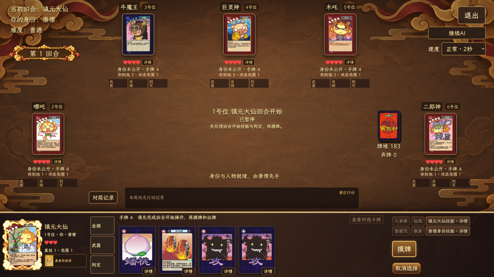
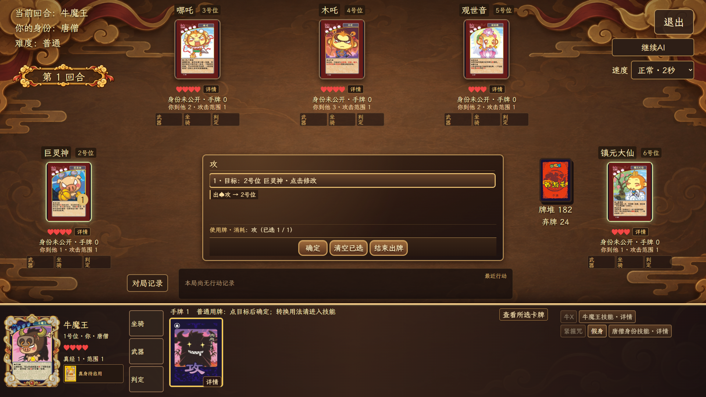
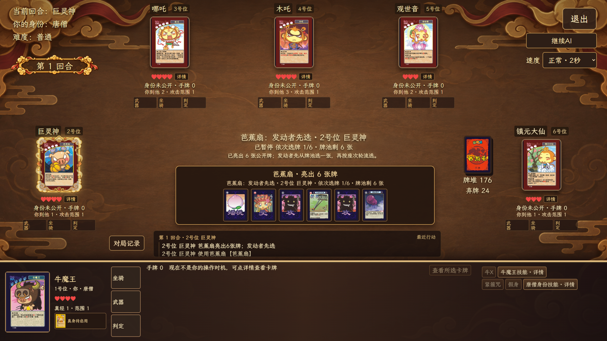
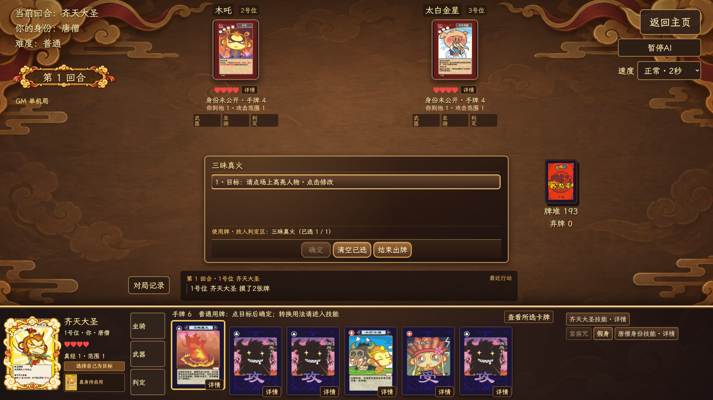

# 西游杀桌面版

  

当前本地开发版本：v0.9.0 · 本仓库仅展示说明与图片

西游杀桌面版目前提供 3–12 人单机对局：1 名真人与 2–11 名本地机器人同场。开局可选择简单、普通、困难难度；联机模式入口仍未开放。

## 对局流程

1. 选择人数和机器人难度。
2. 随机分配身份。唐僧身份公开，其余身份默认隐藏；死亡后会公开。
3. 从三张人物中选择一张；每名玩家初始获得 4 张手牌。
4. 正常回合依次处理回合开始与判定、摸牌、出牌、弃牌。手牌超过上限时必须先弃至上限，才能结束回合。
5. 攻击、单挑、群体技能、延时牌和濒死会进入对应响应窗口；所有操作记录写进最近行动和完整对局记录。

## 身份与胜负

| 人数 | 身份组成 |
|---:|---|
| 3 人 | 唐僧、取经人、妖怪 |
| 4 人 | 唐僧、取经人、妖怪、神仙 |
| 5 人 | 唐僧、取经人、2 名妖怪、神仙 |
| 6 人 | 唐僧、取经人、3 名妖怪、神仙 |
| 7 人 | 唐僧、2 名取经人、3 名妖怪、神仙 |
| 8 人 | 唐僧、2 名取经人、4 名妖怪、神仙 |
| 9 人 | 唐僧、3 名取经人、4 名妖怪、神仙 |
| 10 人 | 唐僧、3 名取经人、4 名妖怪、2 名神仙 |
| 11 人 | 唐僧、3 名取经人、5 名妖怪、2 名神仙 |
| 12 人 | 唐僧、4 名取经人、5 名妖怪、2 名神仙 |

7–12 人身份数量按用户提供的《西游杀规则手册》准备阶段表配置；3 人局保留原有配置。每人仍从三张不重复的候选人物中选一张。

- 唐僧与取经人：唐僧存活，且妖怪与神仙全部阵亡。
- 妖怪：唐僧阵亡，且仍有妖怪存活。
- 神仙：唐僧与妖怪全部阵亡，且神仙存活。

## 人物与技能

当前人物池有 39 人。主页“卡牌查询”的人物页可以搜索人物，查看人物卡面、仙／妖属性、体力上限和技能说明；对局中也可点击人物卡查看详情。下表是人物能力入口。

| 人物 | 阵营 | 主要技能 |
|---|---|---|
| 白骨精 | 妖 | 变身、反击、白骨 |
| 东海龙王 | 仙 | 翻江倒海、普降甘霖 |
| 二郎神 | 仙 | 人狗合一、天眼 |
| 观世音 | 仙 | 圣水、感化 |
| 红孩儿 | 妖 | 攻受结合 |
| 狐狸精 | 妖 | 诱惑、魅力 |
| 巨灵神 | 仙 | 反击 |
| 弥勒佛 | 仙 | 乐天、超度 |
| 木吒 | 仙 | 定力 |
| 哪吒 | 仙 | 三头六臂 |
| 牛魔王 | 妖 | 牛X |
| 琵琶精 | 妖 | 靡靡之音、幽雅 |
| 沙和尚 | 妖 | 流沙河、苦力、限定赠装 |
| 孙悟空 | 妖 | 美猴王、救命毫毛 |
| 太白金星 | 仙 | 西方巡使、拂尘、仙鹤联动 |
| 太上老君 | 仙 | 金丹、老君炉 |
| 阎罗王 | 仙 | 阎王醉、判官之能 |
| 镇元大仙 | 仙 | 人参果、仙风 |
| 猪八戒 | 妖 | 散伙饭、猪八戒娶媳妇 |
| 齐天大圣 | 仙 | 金刚、齐天大圣 |
| 玉皇大帝 | 仙 | 王者风范 |
| 青牛怪 | 妖 | 反击 |
| 玉兔精 | 妖 | 思凡 |
| 托塔天王 | 仙 | 如意宝塔、阵前父子 |
| 雷公 | 仙 | 惊雷 |
| 九头虫 | 妖 | 九头 |
| 黄风怪 | 妖 | 黄风、不劳而获 |
| 蜈蚣精 | 妖 | 嗜血 |
| 虎力大仙 | 妖 | 借力、暴血 |
| 黑风怪 | 妖 | 乘火打劫 |
| 土地公 | 仙 | 遁地、小打小闹 |
| 金角大王 | 妖 | 一览万物、一毛不拔 |
| 银角大王 | 妖 | 玉净瓶子、一毛不拔 |
| 铁扇公主 | 妖 | 天生丽质、家教 |
| 六耳猕猴 | 妖 | 八戒～师傅叫你回家吃饭（硬币判断）、真假难辨 |
| 嫦娥姐姐 | 仙 | 奔月、打小报告 |
| 小白龙 | 仙 | 英俊、任劳任怨 |
| 蜘蛛精 | 妖 | 盘丝洞、施毒 |
| 如来佛祖 | 仙 | 云之尽头、如来神掌 |

唐僧身份另有紧箍咒、假身和混淆视听。

本轮整理的 20 张完整人物卡见 [人物卡图片目录](images/characters-v09/)；蜘蛛精和如来佛祖均为 3 点体力。如来神掌需两张受或单张金钟罩／锦阑袈裟保护；多张群体来源牌在观音和小白龙都取得成功时各分一张，小白龙判定失败时由观音取得全部。三昧真火黑桃版的清边图片见 [技能卡图片](images/skill-cards-v09/三昧真火1.png)。

## 牌库与装备

游戏实际使用 207 张实体牌。卡牌查询中展示的是 71 个实际会出现的花色卡面版本；同一张牌的不同花色会作为不同实体牌入堆。

| 分类 | 牌种数 | 花色卡面版本 | 实体牌数 |
|---|---:|---:|---:|
| 基础牌 | 3 | 12 | 122 |
| 技能牌 | 21 | 40 | 66 |
| 武器 | 10 | 10 | 10 |
| 坐骑 | 9 | 9 | 9 |
| 合计 | 43 | 71 | 207 |

武器包含 4 种常驻武器：七星宝剑、金刚圈、紫金铃铛、九瓣花花锤；以及 6 种一次性附加武器：八丈火尖枪、九齿钉钉耙、方方便便铲、短短狼牙棒、红缨枪、金箍棒。

坐骑共 9 种，所有人物均可按通常装备条件使用其通用距离效果。仙鹤、筋斗云、避水金睛兽、风火轮、白龙马与大鹏金翅鸟的专属技能，仅对应人物或身份可发动。大鹏金翅鸟的专属技能可由弥勒佛或如来佛祖发动；白龙马的专属技能可由唐僧身份或小白龙发动。

芭蕉扇会亮出等同存活人数的公开牌：发动者先选一张，之后从下一位存活玩家开始依次选择。其他人的暗手牌不会公开。

## 存档、记录与回放

单机对局可保存到 3 个存档槽。已结束对局会自动归档；对局日志可查看行动记录，并提供视频回放与诊断记录导出入口。读取旧存档时保留原有行动记录与回放结果。

## 安装与更新

Windows 安装包使用 NSIS，安装器显示当前版本，并与游戏使用同一套西游主题图标和插画。本仓库目前只展示 README 和图片；本地 v0.9.0 未打包或发布安装包。后续发布安装包后，可在“游戏设置 → 版本与更新”中手动检查；发现新版本后先下载并验证签名，再由安装向导完成安装。

GitHub 连接或下载失败时，设置页会提供备用下载页面。正常更新会保留存档与已归档对局；若手动卸载旧版，不要勾选“删除应用数据”，重要存档建议提前备份。

## v0.9.0 更新

- 加入照片中的 18 名人物、清晰印刷卡面与人物技能，齐天大圣是独立于孙悟空的人物。
- 任意人物可装备专属坐骑取得通用距离效果；对应人物才可发动专属技能。弥勒佛可使用大鹏金翅鸟交换身份。
- 托塔天王猜拳平局重新选择；六耳猕猴改用隐藏选择的硬币正反面判断。
- 退出弹窗增加固定可见的“导出诊断 TXT”，不选存档槽也可导出，存档校验失败时仍尽量记录当前状态。桌面版导出视频、诊断 TXT 与诊断 JSON 时会先选择保存位置；取消选择不会生成文件。
- 主页新增退出确认；牌桌返回主页与窗口关闭分别显示对应的保存、放弃和继续操作。
- 主页与说明文字明确标注“非官方、非商业、独立个人作品”。
- 本地单人对局扩至 3–12 人，7–12 人身份按手册分配；修正三昧真火选牌时横跨牌桌的按钮和人物卡外侧白边。
- 追加蜘蛛精与如来佛祖，完整人物池为 39 人；接入盘丝洞、持续施毒、无距离攻和如来神掌。
- 核对技能伤害与受伤技能联动：补齐小白龙判定，修正如来神掌和铁扇转化火焰山的两张来源牌共享取得。

## v0.8.1 更新

- 卡牌查询新增“人物”页，可搜索当前 19 名人物，查看卡面、属性、体力上限和技能说明，并可放大卡面。
- 卡牌和人物使用同一个查询窗口；切换页面时，各自的搜索和选择状态会保留。
- 更新安装方式改为需要用户确认的安装向导；安装前会验证更新包签名。

## v0.8.0 更新

- 新增卡牌查询，按基础、技能、武器、坐骑分类，也可以搜索牌名并查看花色与数量。
- 对局日志与卡牌查询使用同系列入口和祥云金边界面；归档支持查看、回放和导出。
- 最近行动最新置顶；鼠标悬停手牌时可直接用滚轮横向浏览。
- 大量手牌一次弃置时合并显示飞牌，弃牌完成后明确提示结束回合。
- 芭蕉扇亮出公开牌后显示发动者先选和下一位接续选牌的过程。
- 修复无敌只锁住体力数值时，攻击命中、人物技能和装备后续效果被误跳过的问题。
- 安装向导显示版本号，统一中文字体和主题插画；已安装版本的维护页提供清晰的覆盖或卸载选项。

## 参考与鸣谢

本项目参考了 [w159014462z/UnityDemo](https://github.com/w159014462z/UnityDemo) 的既有工程与玩法资料，并以 Tauri、React 和 TypeScript 重新实现桌面端逻辑与界面。

主页背景、标题、卷轴与行动框为本项目新制作素材。界面字体选用 [Ma Shan Zheng](https://github.com/googlefonts/mashanzheng/blob/master/OFL.txt) 和 [LXGW WenKai Lite](https://github.com/lxgw/LxgwWenKai-Lite/blob/main/OFL.txt)，本地程序随附许可文件。旧卡面、人物图与其他第三方素材仍需逐项核查授权，本仓库不对这些资源作再授权。

## 关于卡牌资料

非官方、非商业、独立个人作品。原作角色与相关素材权利归各自权利人；如有权利问题，请联系作者处理。

卡牌资料来自现有旧版实体卡和玩家整理的规则。发现卡面、技能或结算错误时，欢迎附上牌面或规则照片提交 [Issue](https://github.com/zxz0119/xiyousha-desktop/issues/new)。
