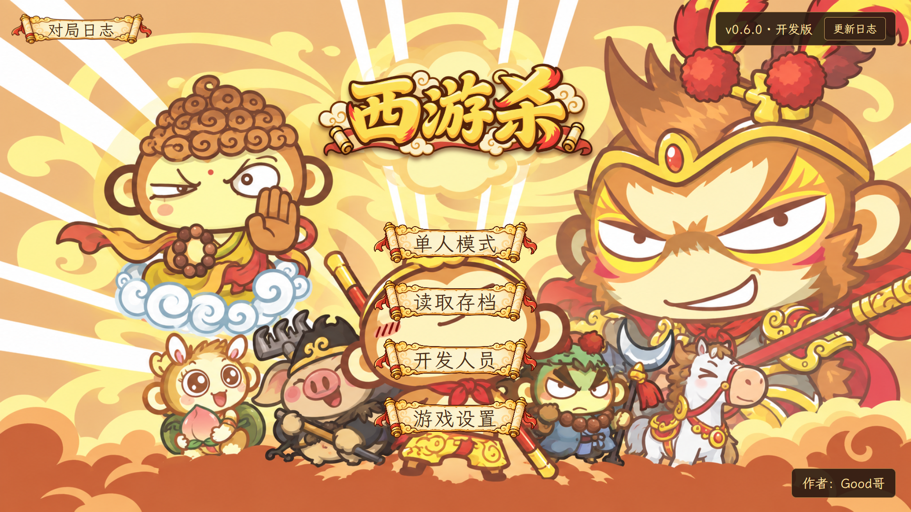
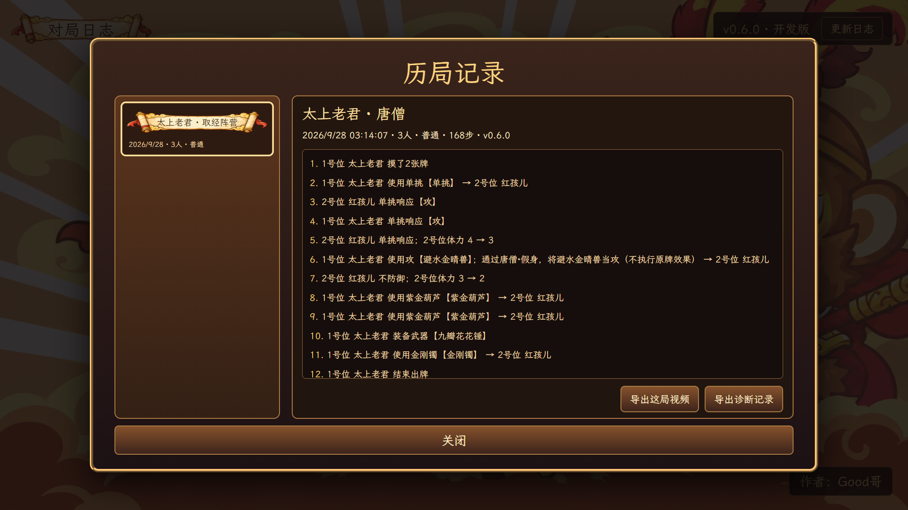
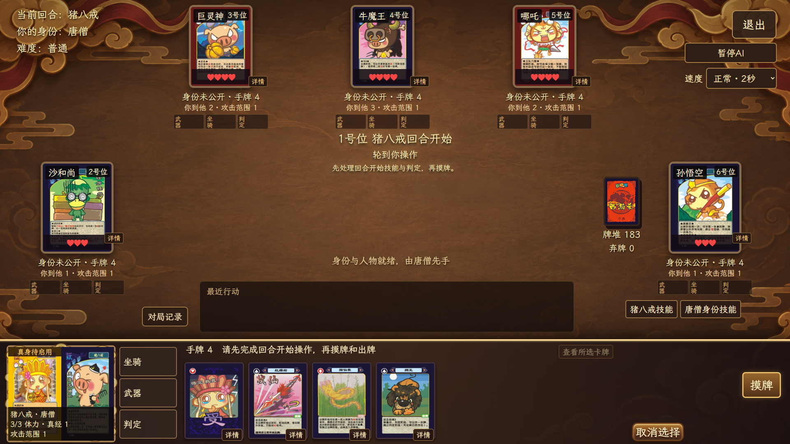
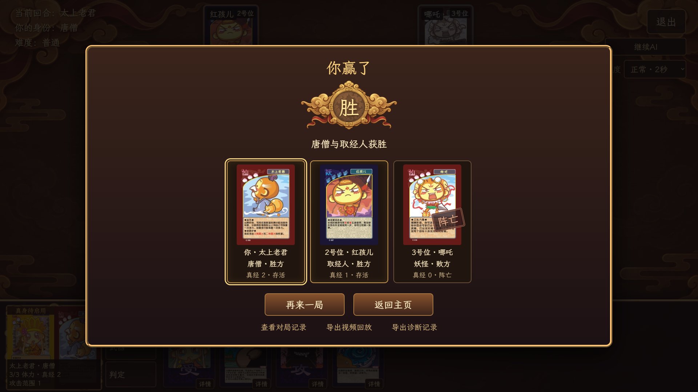

# 西游杀桌面版

  

  《西游杀》单人桌面卡牌游戏，当前版本 v0.6.0。

  基于 Tauri、React 与 TypeScript 构建。

## 当前版本

当前支持 3–6 人单人对局：1 名真人玩家和 2–5 名本地机器人。进入单人模式后先选择人数与简单、普通、困难难度，再抽身份、从三张候选人物中选一张；目前有 19 名人物。多人联机尚未加入。

主页左上角的“对局日志”可查看已结束的每一局及逐条行动记录，和三格进行中存档相互独立。

## 当前可用功能

- 人物与身份技能、攻防、武器坐骑、延时判定、濒死救援和胜负结算
- 唐僧人物层与真身、白骨精变身，以及对应的技能和牌区显示
- 普通与特殊弃牌多选确认；当前行动与响应人物的祥云光圈提示
- 三格本地存读档；读取窗口可确认删除指定槽位，已结束的存档有明确标记
- 每局结束自动归档、逐条查看记录，并从当前结算页或日志页导出诊断 JSON
- 静音、曲目、音量和减少动态效果设置；背景音乐署名与许可说明

## 回放与开发状态

视频回放在本地开发环境可导出 MP4，支持进度、取消和完成后播放；当前依赖本机 Node.js、Microsoft Edge、FFmpeg 及前端构建。安装包仍需完成依赖封装与发布验收。“导出诊断记录”生成 JSON 排错数据，可能含有本局未公开的身份与手牌，请仅在需要反馈问题时分享。

界面正在调整规则边界、AI 决策与旧素材来源。游戏人数、机器人难度和行动播放速度分别设置；人数首次进入时预选 6 人。

手册所列 **7–12 人**留待后续扩展。若仍要求每人独占三张不重复候选，十二人至少需要 36 张不同人物牌；当前 19 名人物只按 3–6 人实现。

多人联机计划在单人规则与交互稳定后加入，暂无确定时间。源码与安装包尚未作为公开发行版提供。

## 参考与鸣谢

本项目参考了 [w159014462z/UnityDemo](https://github.com/w159014462z/UnityDemo) 的既有工程与玩法资料，并以 Tauri、React 和 TypeScript 重新实现桌面端逻辑与界面。

主页背景、标题、卷轴与行动框为本项目新制作素材。界面字体选用 [Ma Shan Zheng](https://github.com/googlefonts/mashanzheng/blob/master/OFL.txt) 和 [LXGW WenKai Lite](https://github.com/lxgw/LxgwWenKai-Lite/blob/main/OFL.txt)，本地程序随附许可文件。旧卡面、人物图与其他第三方素材仍需逐项核查授权，本仓库不对这些资源作再授权。

## 技术栈

- [Tauri 2](https://tauri.app/)
- [React](https://react.dev/)
- [TypeScript](https://www.typescriptlang.org/)
- [Rust](https://www.rust-lang.org/)

---

> 当前为开发版本，尚未发布可下载安装包。
